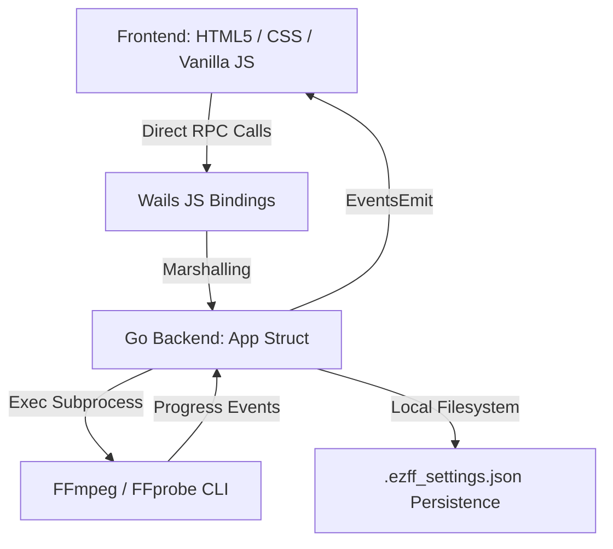

# EZFF — Developer Architecture & AI Co-Pilot Integration Guide

Welcome to the official developer documentation for **EZFF (Easy FFmpeg)**. This comprehensive guide outlines the codebase structure, execution models, and data flows of the application. It is designed to help human developers and AI coding agents quickly locate, modify, debug, or extend any feature in the application.

---

## 1. Architectural Overview

EZFF is built on **Wails v2**, a hybrid framework that bridges native Go backends with modern web frontends using lightweight platform-native WebViews (Chromium/WebView2 on Windows).



### Key Pillars:
1. **The Go Backend (`app.go`)**: Binds native operating system operations (file pickers, directory dialogs), handles local settings persistence, and spawns background FFmpeg/FFprobe sub-processes without flashing black command windows.
2. **The Wails Binding Layer**: Automatically generated during compilation (`wails dev` or `wails build`). Any public Go method `func (a *App) MethodName(...)` is exposed to the frontend in `frontend/wailsjs/go/main/App.js` as an asynchronous promise.
3. **The Frontend (`index.html`, `main.js`, `style.css`)**: Implements a glassmorphic dashboard, responsive custom CSS tooltips, real-time command preview modal, custom terminal executor, and settings menu.

---

## 2. Directory Structure Map

```
easy-FFmpeg/
├── main.go                     # Wails entrypoint & window bootstrapping configuration
├── app.go                      # Core Go backend controller (FFmpeg runner, Settings, Dialogs)
├── go.mod / go.sum             # Go module specifications
├── DEVELOPER_GUIDE.md          # This documentation file
│
└── frontend/                   # UI Files
    ├── index.html              # Monolithic UI view (Welcome, Dashboard, Concatenator, Modals)
    ├── wailsjs/                # Automatically generated Wails JS bindings (Do not edit directly)
    └── src/
        ├── main.js             # Core JS controller (DOM cache, Events, Command compilers)
        ├── style.css           # Styling system (Glassmorphic variables, Tooltips, Custom Scrollbars)
        └── app.css             # Supplementary Wails layout settings
```

---

## 3. Core Technical Modules & File References

Below is a detailed index of every major feature, explaining exactly where to find the corresponding backend and frontend code to make modifications using relative repository links.

---

### Module A: File Drag-and-Drop & Metadata Analysis

When a user drops a media file onto the UI, EZFF triggers a metadata probe using `ffprobe`.

*   **Frontend HTML Dropzone**:
    *   File: [frontend/index.html](frontend/index.html) -> `#dropzone` and `.global-drop-overlay`
*   **Frontend Event Wiring**:
    *   File: [frontend/src/main.js](frontend/src/main.js)
    *   Method: `OnFileDrop` callback registering inside startup, triggering `analyzeFile(filePath)`.
*   **Backend Metadata extraction**:
    *   File: [app.go](app.go)
    *   Method: `func (a *App) GetMediaInfo(filePath string) (string, error)`
    *   *Implementation detail:* Spawns an inline `ffprobe` process returning JSON metadata. Uses `HideWindow: true` to prevent prompt flashes.

---

### Module B: Cinematic Thumbnail & Cover Art Extractor

EZFF extracts a frame at `00:00:01` for videos, or cover arts at `00:00:00` for audio formats (`.mp3`, `.flac`, `.m4a`, etc.) asynchronously.

*   **Frontend Image Container**:
    *   File: [frontend/index.html](frontend/index.html) -> `#videoThumbnailContainer` and `#videoThumbnailImg`
*   **Frontend Trigger**:
    *   File: [frontend/src/main.js](frontend/src/main.js) -> Async fetch inside `analyzeFile` using `GetVideoThumbnail(currentFilePath)`.
*   **Backend Frame Engine**:
    *   File: [app.go](app.go)
    *   Method: `func (a *App) GetVideoThumbnail(videoPath string) (string, error)`
    *   *Implementation detail:* Writes binary frame output directly to an in-memory buffer using stdout pipe (`pipe:1`) with parameters `-f image2 -c:v png`. Encodes the buffer to a Base64 PNG Data URI (`data:image/png;base64,...`) and returns it without any disk I/O.

---

### Module C: Lossless Remuxing (Video & Audio)

Changes the file container format (e.g. `.mkv` to `.mp4`) losslessly in seconds.

*   **Frontend Action & Dropdowns**:
    *   File: [frontend/index.html](frontend/index.html) -> `#remuxBtn`, `#remuxFormatSelect`, and `.remux-title span`.
*   **Frontend Title Overrides**:
    *   File: [frontend/src/main.js](frontend/src/main.js) -> Dynamically rewrites title text to `Lossless Remux (Video)` or `Lossless Remux (Audio)` depending on streams.
*   **Backend Copy Runner**:
    *   File: [app.go](app.go)
    *   Method: `func (a *App) RemuxFile(inputPath string, extension string, totalDuration float64) (string, error)`
    *   *Implementation detail:* Tries instant copying using `-c copy`. If direct copying fails (e.g., container codec mismatch), it falls back to transcoding automatically.

---

### Module D: Lossless Stream Repair & Stream Injection

Fixes unindexed indexing issues in video files, and allows merging external subtitle/audio tracks.

*   **Lossless Repair (Ignores stream index errors)**:
    *   Trigger: `#repairBtn` in [frontend/index.html](frontend/index.html)
    *   Wiring: `repairBtn` event in [frontend/src/main.js](frontend/src/main.js) (Routes to `RemuxFile` with original format).
*   **Stream Injection (Inject external audio/subtitles)**:
    *   Frontend Card: `#streamInjectorDropzone` and `#injectBtn` in [frontend/index.html](frontend/index.html)
    *   Backend Method: `func (a *App) InjectStream(basePath string, injectPath string, totalDuration float64) (string, error)` in [app.go](app.go)
    *   *FFmpeg command:* `ffmpeg -y -i basePath -i injectPath -map 0 -map 1 -c copy outputPath` (with transcoding fallback).

---

### Module E: Smart Concatenator (Queue & List-Merge)

Joins multiple files of the same format without re-encoding.

*   **Frontend Queue**:
    *   File: [frontend/index.html](frontend/index.html) -> `#concatQueueList` (Implements drag-and-drop index sorting).
*   **Frontend Action**:
    *   File: [frontend/src/main.js](frontend/src/main.js) -> `#concatExecuteBtn` compiling queue durations.
*   **Backend Concat List Engine**:
    *   File: [app.go](app.go)
    *   Method: `func (a *App) ConcatFiles(inputPaths []string, totalDuration float64) (string, error)`
    *   *Implementation detail:* Writes a temporary list text file mapping input paths, escaping Windows single quotes correctly. Invokes `ffmpeg -f concat -safe 0 -i listFilePath -c copy`.

---

### Module F: Advanced Custom Encoder (Transcoding)

Exposes robust controls to customize codecs, bitrates, filters, and container chassis.

*   **Frontend Panels & Layouts**:
    *   File: [frontend/index.html](frontend/index.html) -> Video parameters (left column), Audio parameters (right column), and Output Container selection box + Action block (bottom board).
*   **Frontend Codec Selection / Ready Toggles**:
    *   File: [frontend/src/main.js](frontend/src/main.js) -> Listeners on video codec dropdown `#encVCodec` (revealing resolution/fps inputs) and audio codec dropdown `#encACodec`. Action starts at `#startTranscodeBtn`.
*   **Backend Comprehensive Transcoder**:
    *   File: [app.go](app.go)
    *   Method: `func (a *App) TranscodeFile(...) (string, error)`
    *   *Implementation detail:* Programmatically compiles slices of strings into the exact required arguments for custom encoding streams, scaling filters, constant rate factors (CRF), audio quality presets, and custom layouts.

---

### Module G: Global Command Preview Floating Button

Displays the live, real-time constructed FFmpeg command before execution.

*   **Frontend Floating Button**:
    *   File: [frontend/index.html](frontend/index.html) -> `#globalShowCmdBtn` floating in header next to the status dot.
*   **Dynamic Command Compiler**:
    *   File: [frontend/src/main.js](frontend/src/main.js) -> Event listener `globalShowCmdBtn.addEventListener('click')` which dynamically detects the active tab (Dashboard, Concat queue, or Custom Encoder) and compiles the exact string on-the-fly. Displays the output inside the interactive modal `#cmdModal`.

---

### Module H: Interactive Custom Command Executor

Allows advanced users to write or modify any FFmpeg string and run it natively inside EZFF.

*   **Frontend Interactive Modal**:
    *   File: [frontend/index.html](frontend/index.html) -> `#cmdModal`, containing the interactive `<textarea id="cmdPreText">` and execution button `#runCustomCmdBtn`.
*   **Frontend Handler**:
    *   File: [frontend/src/main.js](frontend/src/main.js) -> `runCustomCmdBtn.addEventListener('click')` calling backend Go binding `RunCustomCommand(cmd, currentDuration)`.
*   **Backend Natively Executed Commands**:
    *   File: [app.go](app.go)
    *   Method: `func (a *App) RunCustomCommand(commandStr string, totalDuration float64) error`
    *   Helper String Tokenizer: `func (a *App) parseCommandString(cmdStr string) []string`
    *   *Implementation detail:* Correctly splits raw command strings into shell execution arguments while fully preserving arguments bounded inside double quotes (vital for directories with spaces).

---

### Module I: Global Output Settings Persistence

Toggles output modes: Save Next to Original, Save in Custom Fixed Folder, or Ask Every Time.

*   **Frontend Settings Modal**:
    *   File: [frontend/index.html](frontend/index.html) -> `#settingsModal`, triggered by clicking `#globalSettingsBtn`.
*   **Frontend Forms & Selector Toggles**:
    *   File: [frontend/src/main.js](frontend/src/main.js) -> Event handlers for `globalSettingsBtn` opening, `browseOutputDirBtn` folder browsing, and `saveSettingsBtn` saving inputs.
*   **Backend Settings Controllers & File Persistence**:
    *   File: [app.go](app.go)
    *   Type: `type EZFFSettings struct`
    *   Go Methods:
        *   `SelectFolder() (string, error)` (opens `runtime.OpenDirectoryDialog` using native Wails `OpenDialogOptions`).
        *   `GetOutputSettings() (map[string]string, error)` (fetches variables).
        *   `SetOutputSettings(mode string, customDir string) error` (persists settings).
        *   `loadSettings() / saveSettings() / getSettingsPath()` (loads/saves settings to a local JSON file `.ezff_settings.json` located inside the User's Home Profile directory).
        *   `getOutputPath(title, defaultFilename, filterName, filterPattern, originalInputPath) (string, error)` (helper called by all converters to decide if it should write instantly to directory or prompt the Save Dialog).

---

## 4. Key Styles & CSS Variables

All colors, scrollbars, glassy cards, transitions, and responsive tooltip structures are located in **[frontend/src/style.css](frontend/src/style.css)**.

*   **Primary Palette Coordinates**:
    *   `--bg-main`: `#0F1115` (Deep dark slate background)
    *   `--bg-card`: `#171A21` (Soft slate glassy cards)
    *   `--border-color`: `#262B36` (Border dividers)
    *   `--color-primary`: `#59D14F` (Brand EZFF Green accent)
    *   `--text-bright`: `#F5F7FA` (Main titles text)
    *   `--text-muted`: `#A7B0BE` (Secondary gray text)
*   **CSS Custom Tooltips**:
    *   Styled natively using `[data-tooltip]` attributes and absolute pseudo-elements `::after` with layout transformation animations.

---

## 5. Guidelines for AI Agents & Co-Pilots

When modifying or adding new options to EZFF, ensure you follow these critical development patterns:

1.  **Prevent Command Prompt Flashes on Windows**:
    *   Whenever executing native commands in Go (e.g. `exec.Command`), you **must** assign `HideWindow` attribute:
        ```go
        cmd := exec.Command("ffmpeg", args...)
        cmd.SysProcAttr = &syscall.SysProcAttr{HideWindow: true}
        ```
2.  **Ensure Safe Windows Path Normalization**:
    *   Use `filepath.ToSlash(path)` when parsing files or passing inputs inside temporary text lists (like Smart Concat lists) to avoid FFmpeg command escapes failing on backslashes (`\`).
3.  **Use the Unified Output Path Resolver**:
    *   If you implement a new audio/video converter or pipeline, never call `runtime.SaveFileDialog` directly in Go. Always call `a.getOutputPath(...)` to respect the User's selected Output Settings (Same Dir / Custom Dir / Ask Dialog).
4.  **Regenerate Bindings After Go Edits**:
    *   Whenever you modify, add, or rename any public method in `app.go`, tell the developer to run `wails dev` or perform a rebuild. Wails will parse Go comments and generate identical Javascript bindings inside the `frontend/wailsjs/` folder automatically.
5.  **Always Keep HTML IDs Clean & Unique**:
    *   Ensure all buttons, dialog selectors, and dynamic display labels contain clean, unique `id` attributes to avoid element collision in monolithic layouts.

---
*EZFF Codebase Architecture documentation complete.*
