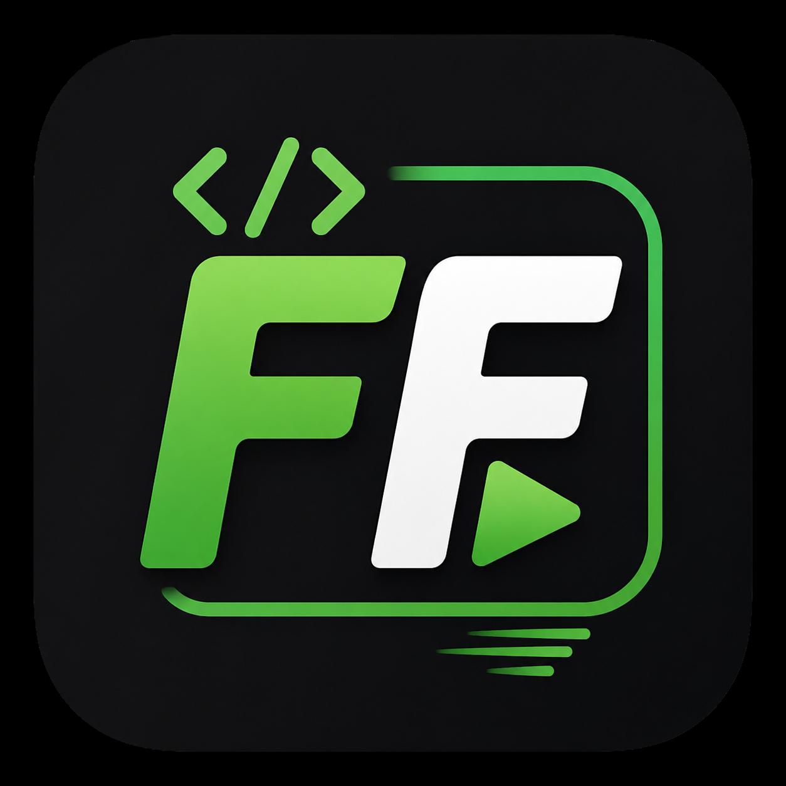
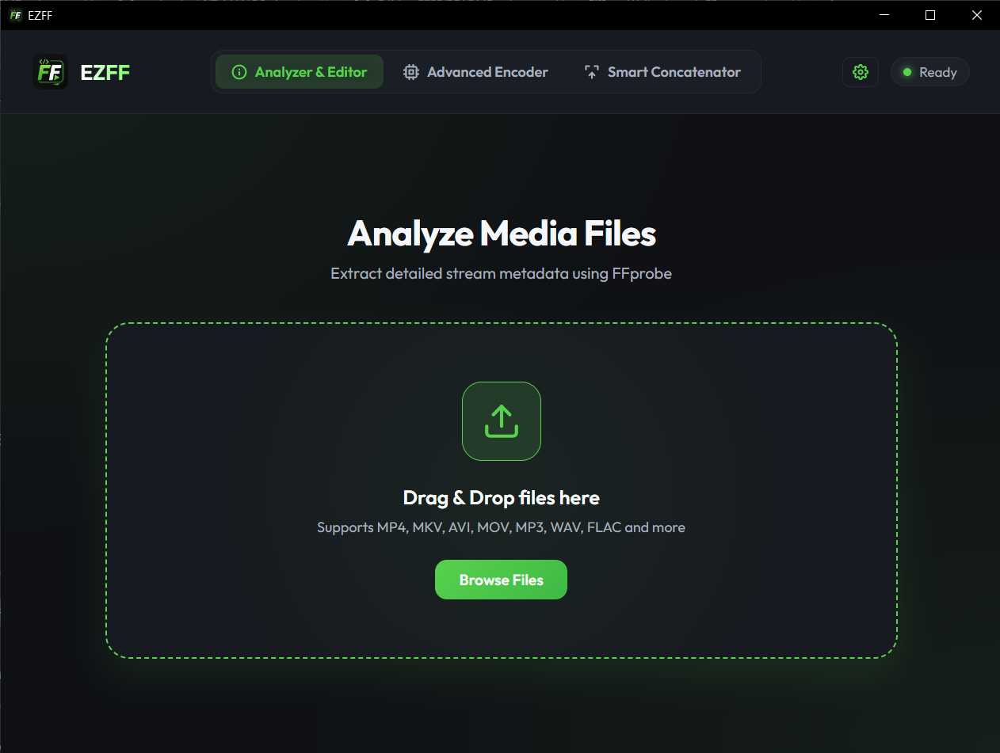
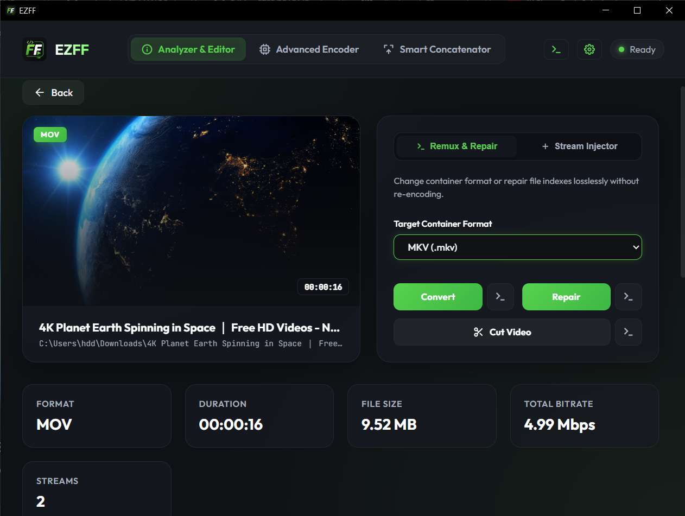
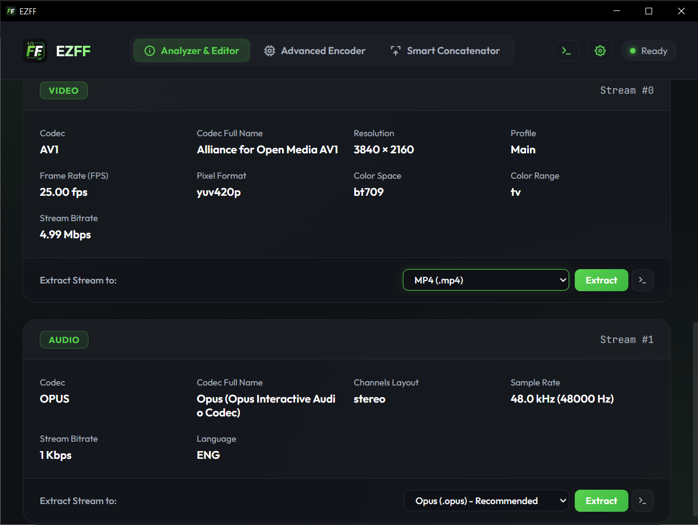
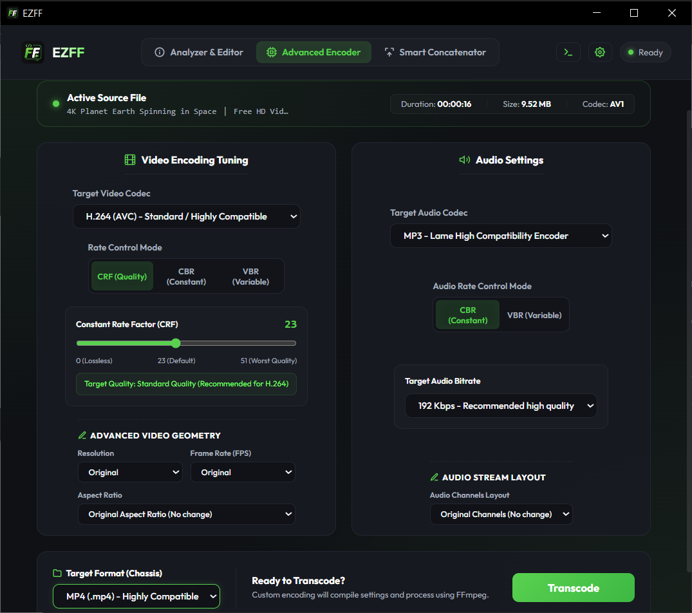
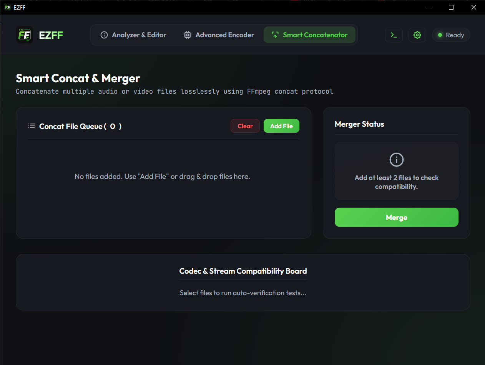

<div align="center">



# EZFF (Easy FFmpeg) 
EZFF is a premium, high-performance, glassmorphic desktop media-processing suite built on **Wails v2** and **FFmpeg**. It combines the extreme speed of native command-line utility operations with a state-of-the-art, dark-themed user interface, allowing creators and developers to execute lossless remuxing, stream extraction/injection, merging, custom transcoding, and live command compiler execution seamlessly.

[](https://wails.io)
[](https://go.dev)
[](https://nodejs.org)
[](https://microsoft.com)
[](LICENSE)
</div>

---
[](https://github.com/mohmd-v1/EZFF/releases)
### 📥 [Download Latest Release for Windows (ZIP)](https://github.com/mohmd-v1/EZFF/releases/download/untagged-8f65d754a69ae3cb3add/EZFF-Windows.zip)


---
## Screenshots

| HOME  |
|---------------|
|   |

| Lossless Remuxing (Instant | Extract Stream |
|--------|---------|
|  |  |

| Advanced Custom Encoder | merge them instantly without re-encoding |
|----------|-------------|
|  |  |
---

## ✨ Key Features Showcase

*   ⚙️ **Dynamic FFmpeg Checker & Auto-Installer**: Upon startup, EZFF checks if FFmpeg is installed on your Windows machine. If found, it displays the installed version in the settings. If missing, it provides a dialog box with a one-click auto-installer using Windows Package Manager (`winget install "FFmpeg (Essentials Build)"`) and quick-copy terminal instructions.
*   🏎️ **Lossless Remuxing (Instant)**: Swap media containers (e.g., MKV, MP4, MOV, WebM, TS, AVI) in milliseconds. EZFF copies streams losslessly (`-c copy`) and features an automatic smart fallback to transcoding if direct copying fails.
*   🔍 **Cinematic Media Probe & Cover Art Extractor**: Drag and drop any video or audio file. EZFF instantly parses stream metadata with `ffprobe` and extracts base64 cinematic frame previews or album art in memory asynchronously, bypassing secondary disk writes.
*   ✂️ **Lossless Cutting & Trimming**: Truncate videos rapidly by selecting specific starting (`-ss`) and ending times with a modern popup window. Includes settings to customize the position of the `-ss` parameter (before input for fast copying, or after input for high accuracy) and custom settings like `-avoid_negative_ts make_zero`.
*   🛠️ **Lossless Stream Repair**: Fix corrupted indexing or stream markers on video files instantly with single-click error ignore parameters (`-err_detect ignore_err`).
*   📦 **Stream Extractor & Injector**: 
    *   **Extract Stream**: Extract individual video, audio, or subtitle streams into standard formats or custom format containers.
    *   **Inject Stream**: Merge external audio tracks or subtitles into base media files seamlessly.
*   🔗 **Smart Concatenator Queue**: Drag, drop, and rearrange files of identical codecs in a visual list to merge them instantly without re-encoding.
*   🎛️ **Advanced Custom Encoder**: Fine-tune custom transcoding streams using an intuitive configuration panel including video/audio codecs, bitrates, channel downmix, scaling filters, frame rate, speed presets, and container chassis. Support for typing custom codecs, bitrates, or containers manually!
*   🌐 **Floating CLI Preview & Executor (`>_`)**: Tap the permanent console icon in the header to preview the exact compiled FFmpeg command for the active screen. You can edit, copy, or execute your custom command natively directly in the app modal.
*   💾 **Persistent Output Location Overhaul**: Toggle between saving files automatically in the same folder as the source, routing to a persistent custom fixed folder, or being asked every time. Settings are saved across sessions in `~/.ezff_settings.json`.

---

## 🎨 Premium Visual Identity

EZFF is designed to stun at first glance with elegant, high-contrast layouts:
*   **Color Palette**: Dark Slate background (`#0F1115`) with semi-transparent glassy cards (`#171A21`), bright typography (`#F5F7FA`), and a glowing Neon Green accent theme (`#59D14F`).
*   **CSS Tooltips**: Ultra-responsive, hardware-accelerated tooltips on hover (`[data-tooltip]` attributes) rendered in pure CSS, ensuring zero lag.
*   **Micro-Animations**: Fluid scale, slide-up modal entries, drag-over glow states, and progress bar trackers.

---

## 🛠️ System Prerequisites

To run and build EZFF, make sure you have the following installed on your machine:

1.  **Go** (version 1.21 or higher) -> [Golang Downloads](https://go.dev/dl/)
2.  **Node.js** & **NPM** -> [Node Downloads](https://nodejs.org/)
3.  **Wails CLI** -> Install via:
    ```bash
    go install github.com/wailsapp/wails/v2/cmd/wails@latest
    ```
4.  **FFmpeg** & **FFprobe** -> If not already present, EZFF's built-in check will guide you to auto-install it on Windows with one click.

---

## 🚀 Live Development & Installation

Follow these steps to run and build the application on your system:

### 1. Clone the repository
```bash
git clone https://github.com/mohmd-v1/EZFF.git
cd EZFF
```

### 2. Run in Live Development Mode
Starts a fast-refresh Vite dev server for the frontend WebView and compiles Go code:
```bash
wails dev
```

### 3. Build Native Standalone Binary
Compiles the complete project, packages assets, and outputs a highly optimized, native production executable inside `build/bin/`:
```bash
wails build
```

---

## 🤖 AI Co-Pilot & Developer Integration Support

EZFF is designed to be extremely friendly to AI coding assistants (like Gemini, Claude, and GitHub Copilot) and human contributors. 

We maintain a dedicated **[DEVELOPER_GUIDE.md](DEVELOPER_GUIDE.md)** at the root of the project. It outlines:
*   The exact mapping of features to their HTML structures in `index.html`.
*   Asynchronous event wiring and active command compilers in `main.js`.
*   Go process handlers, Persisted structs, and native file wrappers in `app.go`.
*   Explicit rules for Windows path normalization and prompt hiding.

Refer to the developer guide to implement modifications or new capabilities in seconds!

---

## 📄 License

This project is licensed under the MIT License - see the [LICENSE](LICENSE) file for details.
